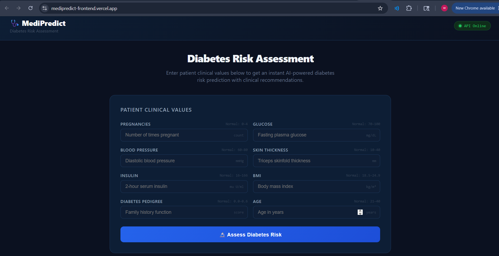
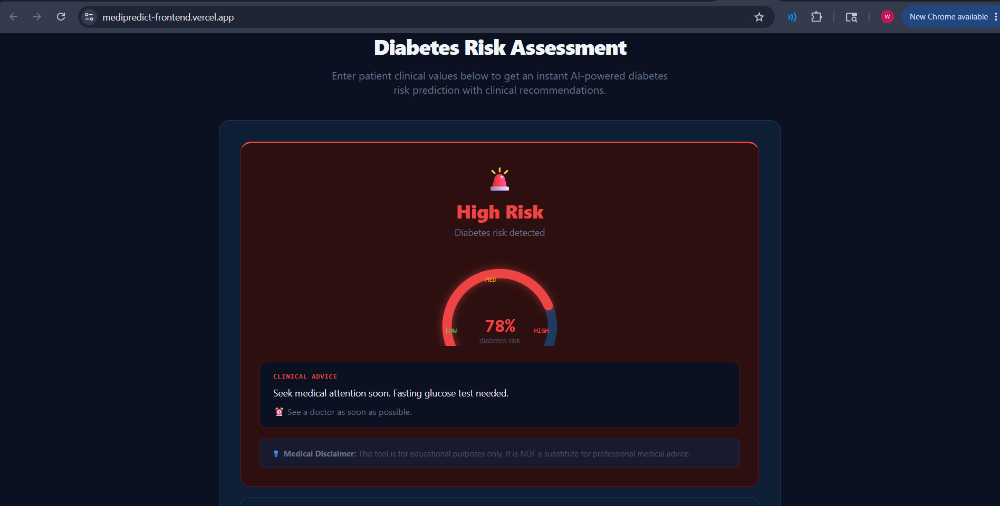
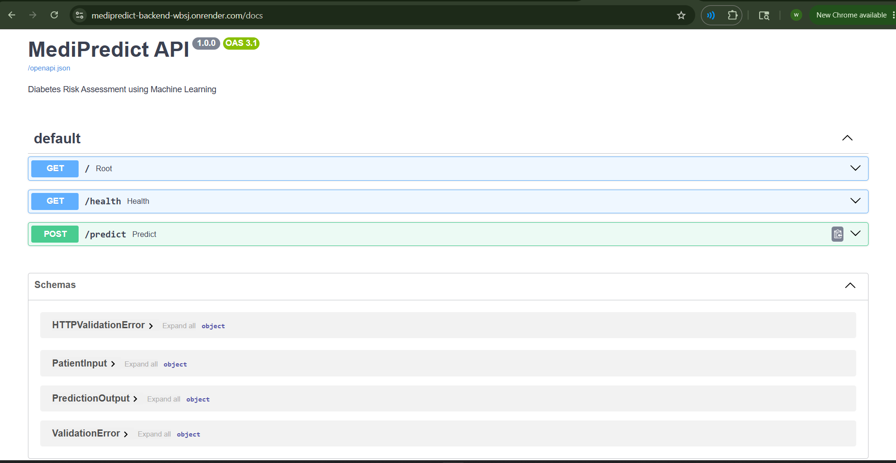

# 🩺 MediPredict — Diabetes Risk Assessment Web App

A full-stack AI-powered web application that predicts diabetes risk 
from patient clinical values and returns actionable medical guidance.

🌐 **Live Demo:** [https://medipredict-frontend.vercel.app](https://medipredict-frontend.vercel.app)
📡 **API Docs:** [https://medipredict-backend-wbsj.onrender.com/docs](https://medipredict-backend-wbsj.onrender.com/docs)

---

## 📸 Screenshots

| Risk Assessment Form | High Risk Result | API Documentation |
|---------------------|-----------------|-------------------|
|  |  |  |

---

## 🧠 What It Does

A patient enters 8 clinical values:
- Glucose level, BMI, Blood Pressure
- Age, Insulin, Skin Thickness
- Pregnancies, Diabetes Pedigree Function

The ML model returns:
- **Risk Level** — Low / Medium / High
- **Risk Percentage** — exact probability score
- **Clinical Advice** — ADA-based recommendations
- **Urgency** — when to see a doctor

---

## ⚙️ Tech Stack

### Frontend
- React + Vite
- Axios for API calls
- SVG risk gauge (custom built)
- Deployed on Vercel

### Backend
- FastAPI (Python)
- Pydantic input validation
- Swagger UI auto-generated docs
- Deployed on Render

### Machine Learning
- scikit-learn
- 7 algorithms compared:
  Logistic Regression, Random Forest, SVM,
  KNN, Decision Tree, Naive Bayes, Neural Network
- SMOTE oversampling for class imbalance
- StandardScaler for feature scaling
- 5-fold stratified cross-validation

---

## 📊 Model Performance

| Metric      | Score |
|-------------|-------|
| AUC-ROC     | 0.84  |
| F1 Score    | 0.76  |
| Sensitivity | 0.78  |
| Accuracy    | 0.80  |

> Model trained on the Pima Indians Diabetes Dataset.
> Validated with 5-fold stratified cross-validation.

---

## 🚀 Run Locally

### Backend
```bash
git clone https://github.com/wania-fatima/medipredict-backend
cd medipredict-backend
python -m venv venv
venv\Scripts\activate
pip install -r requirements.txt
uvicorn main:app --reload
```

### Frontend
```bash
git clone https://github.com/wania-fatima/medipredict-frontend
cd medipredict-frontend
npm install
npm run dev
```

Then open `http://localhost:5173`

---

## 📁 Project Structure
medipredict-frontend/
├── src/
│   ├── App.jsx              ← main app component
│   ├── api.js               ← API service layer
│   └── components/
│       ├── PatientForm.jsx  ← patient input form
│       └── ResultCard.jsx   ← risk result display
└── package.json
medipredict-backend/
├── main.py                  ← FastAPI app
├── requirements.txt
└── models/
├── diabetes_model.pkl
├── scaler.pkl
└── feature_names.pkl
---

## ⚕️ Medical Disclaimer

This tool is for educational purposes only.
It is NOT a substitute for professional medical advice,
diagnosis, or treatment. Always consult a qualified
healthcare provider.

---

## 👩‍💻 Author

**Wania Fatima**
[GitHub](https://github.com/wania-fatima) ·
[LinkedIn](https://www.linkedin.com/in/wania-fatima-1257402ab/)
**Asna Hammad** — [GitHub](https://github.com/asna-154)
